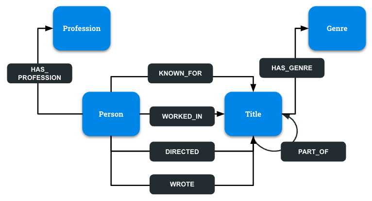
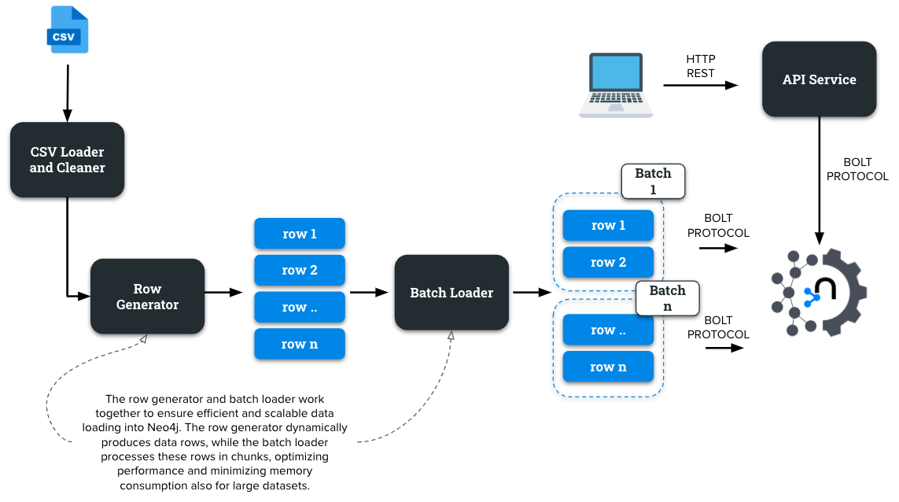

# Graph Schema


## Node Properties
```
"Genre": ["name"]
"Person": ["id", "sources", "name", "birthYear", "endYear"]
"Profession": ["name"]
"Title":["id", "ordering", "sources", "name", "endYear", "originalName", "duration", "alternateNames", "regions", "languages", "types", "attributes", "areOriginalNames", "name_basics_tsv", "title_akas_tsv", "averageRating", "title_crew_tsv", "title_episode_tsv", "title_principals_tsv", "numVotes", "startYear", "title_basics_tsv", "title_ratings_tsv"]
```

## Relation Properties
"HAS_GENRE": []
"HAS_PROFESSION": []
"KNOWN_FOR": []
"PART_OF": ["seasonNumber", "episodeNumber"]
"WORKED_IN": ["ordering", "category", "characters", "job"]
"WROTE": []

# System Design
